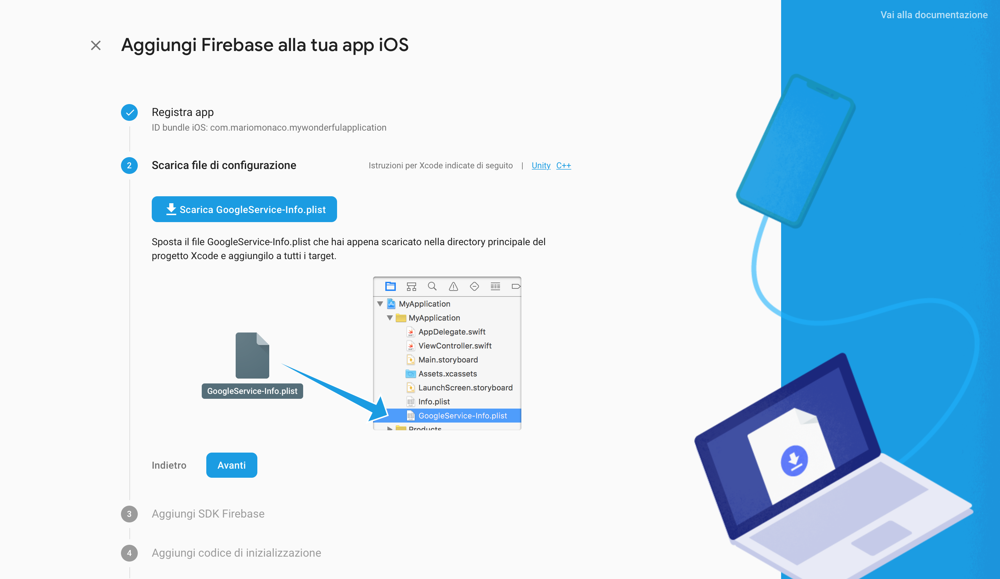
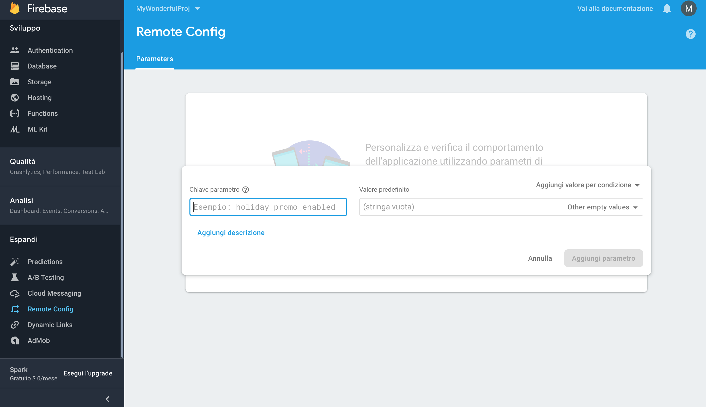

# FirebaseCheckVersion

[](https://cocoapods.org/pods/FirebaseCheckVersion)
[](https://cocoapods.org/pods/FirebaseCheckVersion)
[](https://cocoapods.org/pods/FirebaseCheckVersion)

## Example

To run the example project, clone the repo, and run `pod install` from the Example directory first.

## Requirements

## Installation

CheckVersion is available through [CocoaPods](https://cocoapods.org). To install
it, simply add the following line to your Podfile:

```ruby
pod 'FirebaseCheckVersion'
```

## Configuration

First of all you need, if you haven't yet, to create a Firebase Project for your iOS Application.
Go to [Firebase Console](https://console.firebase.google.com) and create your project:


Once you created your project you need to link your iOS Application:


Now fill the bundle id with yours, download the GoogleService-Info.plist that Firebase created for your project and drag it into your xCode Project in this way:



Go now in your AppDelegate.swift file and write ```FirebaseApp.configure()```  how first line of your ```didFinishLaunchingWithOptions:```  method in this way:

```swift
func application(_ application: UIApplication, didFinishLaunchingWithOptions launchOptions: [UIApplicationLaunchOptionsKey: Any]?) -> Bool {
    FirebaseApp.configure()
    // Override point for customization after application launch.
    return true
}
```
Done!

## Usage

### Add versions to your Firebase

Once you configured all, you need to set the version on your Firebase Project, so navigate to "Remote Config" section into Firebase and add a new property which key is  ```iOSVersion_<yourVersionWithUnderscore>``` where <yourVersionWithUnderscore> is your version number with underscore instead of points:
Eg.
```
1.0 --> 1_0
1.1 --> 1_1
10.03.9 --> 10_03_9
```

So if your app version is 1.0 simple configure a new Remote Configuration like this:



The possible values you can give to your version are:
1. `versionOk` which means the version is up to date
2. `infoUpdate` which means the version is not the last avaiable, but can be used for your application
3. `forceUpdate` which means the version is not the last avaiable and can NOT be used for your application

### Add check to your application

#### Silent Check

In the UIViewController you want to add the check silently you need to insert these code lines:

```swift
import CheckVersion
...

CheckVersion.check{ result in
    //check result and do what you want
}
```

where result is a enum with these possible values:

1. `versionOk` which means your version is currently ok
2. `infoUpdate` which means the version is not the last avaiable, but can be used for your application
3. `forceUpdate` which means the version is not the last avaiable and can NOT be used for your application
4. `versionUnknown` which means your version is not configured on Firebase Console
5. `error` which means an error occurred

#### Alert Check

## Author

andoma93, andoma93@gmail.com

## License

CheckVersion is available under the MIT license. See the LICENSE file for more info.
